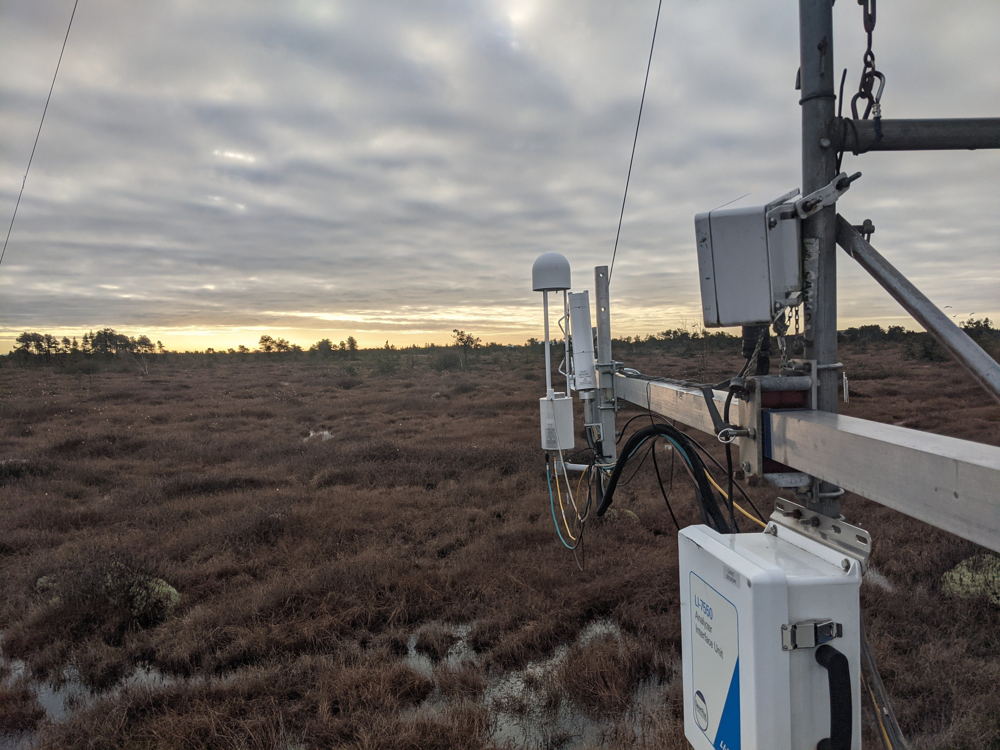

## Eddy Covariance


:::: {.columns}

::: {.column width="50%"}

Ecosystem-scale fluxes of energy, water, and trace gases.

* Spatially integrated, semi-continuous

* Noisy, voluminous data
    * Ideally suited for NN analysis!

:::

::: {.column width="50%"}



<h3>Burns Bog EC Station<br>Delta, BC</h3>

:::

::::


## Neural Networks

Powerful machine learning algorithms that are well suited for non-linear, multi-variate response functions.

* **Universal approximators**: can map any continuous function to an arbitrary degree of accuracy.
    * Given sufficient "hidden nodes", will fit **any** pattern in a dataset
        * Care must be taken to ensure the patterns are real

* Capable of interpolation and extrapolation

## Commonly Cited Limitations


'Code"
#| tbl-colwidths: [35,65]
import pandas as pd

from IPython.display import Markdown
from tabulate import tabulate

df = pd.read_csv('About.csv',sep='|',index_col='Drawback')
Markdown(tabulate(
  df, 
  headers=["Limitation", "Solutions"]
))

```

# Objectives

Provide a framework for applying NN models can be applied to EC data for both descriptive analysis and inferential modelling. 
 
* The [github repository](https://github.com/June-Skeeter/NN_Applications) linked to this presentation has Python code with functional examples that can be used to apply NN models.

## Key Procedures

* Early stopping: End training metrics (e.g., MSE) fail to improve for *e* training epochs
    * *e* = 2 typically provides a robust, generalizable model

* Ensembling: Train a set of N randomly initialled models on N unique interactions of training/testing data
    * A small ensemble for ~10 models is sufficient in most applications

* Input normalization: Z-norm scale all inputs to improve training

## Key Procedures

* Feature inspection: Calculating partial first (and second) derivatives of each input
    * Sum of squared derivatives gives relative influence of each input over output
    * Plotting model derivatives to help ensure mapped relationships are physically plausible
        * An **essential step** and **key advantage** of NN models

## A Simple Example

:::: {.columns}

::: {.column width="50%"}


The Vapor Pressure Deficit (VPD):

* Increases exponentially as a function of air temperature (Ta)
* Decreases linearly as a function of relative humidity (RH).

<!-- 
$$ ea_H = 0.61365*np.exp((17.502*Ta)/(240.97+Ta))$$
$$e_H = RH*ea_H/100$$
$$VPD = (ea_H - e_H)*10$$ -->


:::
::: {.column width="50%"}


'Code"
#| label: Estimating VPD
#| fig-cap: "VPD over a range of Ta, and RH values"
#| layout-ncol: 1
#| warning: False

import numpy as np
import pandas as pd
import tensorflow as tf
import matplotlib.pyplot as plt
from Scripts import MiscFuncs,PlotHelpers
from Scripts import ReadDB, MiscFuncs, NNetFuncs

units = {
    'TA':'$T_a^\circ$C',
    'RH':'RH %',
    'VPD':'VPD hPa'
    }

labels = {
    'TA':'Air Temperature',
    'RH':'Relative Humidity',
    'VPD':'Vapor Pressure Deficit'
    }

range_TA_RH,grid_TA,grid_RH,grid_VPD = MiscFuncs.Create_Grid(
    np.linspace(-50,50),# Define a TA range (in C)
    np.linspace(0,100), # Possible RH values
    MiscFuncs.Calc_VPD # Return Vapor Pressure Defecit
    )
    
bins = np.arange(-10,grid_VPD.max(),15)
cmap = 'PuRd'
norm = [0,grid_VPD.max()]

fig,ax=plt.subplots(1,figsize=(5,5))
PlotHelpers.Contour_Plot(fig,ax,grid_TA,grid_RH,grid_VPD,cmap=cmap,norm=norm,unit = units['VPD'],bins=bins)
ax.set_xlabel('Air Temperature $^\circ$C')
ax.set_ylabel('Relative Humidity %')
ax.set_title('Vapor Pressure Deficit (VPD)')
plt.tight_layout()

# # Use tensorfolow to calculate the first partial derivative of the function
# X_tensor = tf.convert_to_tensor(range_TA_RH.T)
# with tf.GradientTape(persistent=True) as tape:
#     tape.watch(X_tensor)
#     VPD_est = MiscFuncs.Calc_VPD(X_tensor) 
# # Get gradients of VPD_est with respect to X_tensor
# Deriv = tape.gradient(VPD_est,X_tensor).numpy()

# Derivatives = pd.DataFrame(
#     data={
#     'TA':range_TA_RH.T[:,0],
#     'RH':range_TA_RH.T[:,1],
#     'dVPD/dTA':Deriv[:,0],
#     'dVPD/dRH':Deriv[:,1]
#     }
# )

# fig,axes=plt.subplots(2,2,figsize=(8,8),sharey='row')

# grid_dVPD_dTA = Deriv[:,0].T.reshape(grid_TA.shape)
# grid_dVPD_dRH = Deriv[:,1].T.reshape(grid_RH.shape)

# d_bins = np.arange(
#     np.floor(Deriv).min(),np.ceil(Deriv).max(),.5
#     )
# d_cmap = 'bwr'
# d_norm = [
#     Deriv.min(),0, Deriv.max()
#     ]
    
# ax,_ = PlotHelpers.Contour_Plot(fig,axes[0,0],grid_TA,grid_RH,grid_dVPD_dTA,cmap = d_cmap,norm=d_norm,bins=d_bins)
# ax.set_title('dVPD dTa')

# ax,_ = PlotHelpers.Contour_Plot(fig,axes[0,1],grid_TA,grid_RH,grid_dVPD_dRH,cmap = d_cmap,norm=d_norm,bins=d_bins)
# ax.set_title('dVPD dRH')


# y=['dVPD/dTA']
# df = MiscFuncs.byInterval(Derivatives,'TA',y,bins=100)
# ax = PlotHelpers.CI_Plot(axes[1,0],df,y[0])
# # ax.set_title('Partial First Derivative\nVPD with respect to Ta')

# y=['dVPD/dRH']
# df = MiscFuncs.byInterval(Derivatives,'RH',y,bins=100)
# ax = PlotHelpers.CI_Plot(axes[1,1],df,y[0])
# # ax.set_title('Partial First Derivative\nVPD with respect to RH')


# plt.tight_layout()

```

:::

::::


## Partial Derivatives

'Code"
#| label: Derivatives of VPD
#| fig-cap: "This plot shows the partial first derivatives of VPD"
#| layout-ncol: 1
#| warning: False
grid_VPD.min()


```


## Example Data

BB1 Flux tower was established in 2015.

'Code"
from Scripts import ReadDB

# dbNames = {
#     'TA_1_1_1':'TA',
#     'RH_1_1_1':'RH'
# }

# read_new = False
# if read_new == False:
#     Data = ReadDB.get_Traces('BB',['TA_1_1_1','RH_1_1_1'],Dir='/mnt/c/Users/User/PostDoc_Work/database/')
#     print(Data)
#     Data = Data.dropna(axis=0)
#     Data = Data.rename(columns=dbNames)
#     Data.to_csv('temp/BB1_VPD.csv')

# else:
Site = 'BB'
Data = pd.read_csv(f'temp/{Site}_VPD.csv',parse_dates=['TimeStamp'],index_col='TimeStamp')
    
print(Data.head())

Data['VPD'] = MiscFuncs.Calc_VPD(Data['TA'],Data['RH'])
    
fig,axes=plt.subplots(1,3,figsize=(7,4))
Data.hist(column='TA',ax=axes[0],bins=20,edgecolor='k')
axes[0].set_xlabel(units['TA'])

Data.hist(column='RH',ax=axes[1],bins=20,edgecolor='k')
axes[1].set_xlabel(units['RH'])

Data.hist(column='VPD',ax=axes[2],bins=20,edgecolor='k')
axes[2].set_xlabel(units['VPD'])

plt.tight_layout()

Data.describe().round(1)
```


## Artificial Gaps


## Next Steps & Speculations

* u* filtering
* Flux footprint calculations

## Conclusions

They offer the user more control over the structure of the model and inspection of the model derivatives provides a method for validating that the relationships mapped by a model are physically plausible.

## Questions

